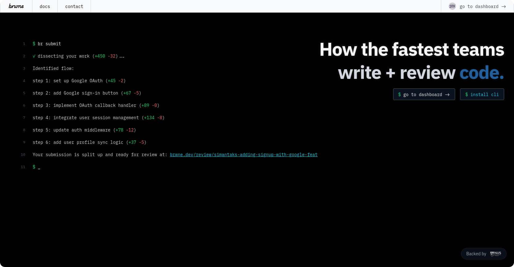

 <!-- use align as CSS is not allowed on GitHub markdown https://github.com/orgs/community/discussions/22728 -->
   <!-- Logo -->
  <h1><a href="https://brwne.dev">brwne</a></h1> <!-- Project Name -->
  
 <!-- Description -->
    The ultra-fast fabric for version control & code review
  

---

## About

**brwne** is a CLI & VS Code extension designed to enhance your development workflow. It provides smart integration for projects by offering powerful code snippets, automated formatting, and custom build & debug commands - all within your favourite editor.

## Getting Started

### Installation

Install the brwne app by following the [installation guide](https://brwne.dev/docs/installation).
